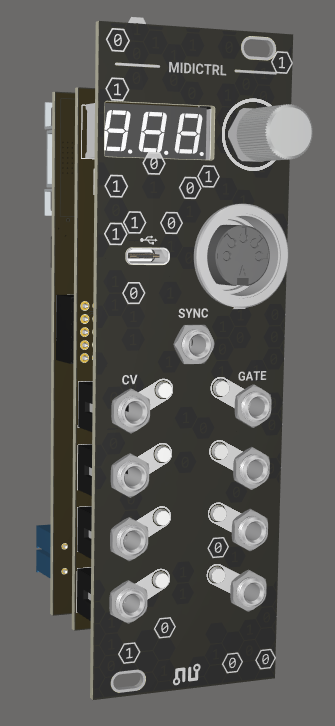

# NU Synths | MIDICTRL

Firmware for the NU Synths 'MIDICTRL' eurorack module. Converts MIDI signals (5 pin MIDI or MIDI-USB) to eurorack compatible control voltage (CV) and gate signals.



For hardware design see [nusynths-midictrl-hardware](https://github.com/noelvissers/nusynths-midictrl-hardware) repository.

## Contents

The following files and folders are in this repository:

|File / Folder |Remarks
|--------------|--------
|.boards/      |Custom board files
|.variants/    |Custom variant files
|.vscode/      |VS Code settings
|include/      |Header (.h) files
|lib/          |Custom libraries
|src/          |Source (.cpp) files
|test/         |Test files
|LICENSE       |-
|README.md     |-
|platformio.ini|-

## Documentation

### General settings

To access the settings, hold the rotary encoder button for 1 second.

Select by pressing the rotary button, go back by holding the button.

|Setting       |Remarks
|--------------|--------
|MIDI channel  |MIDI channel to listen to (All, 1 to 16)
|Synth mode    |Monophonic or polyphonic mode (see below)
|Pitch bend    |Range of the pitch bend wheel (0 to 12 semitones)
|Cock division |MIDI clock divider amount (1 for 1:1, /2 to /128)

### Synth mode

#### Monophonic

In monophonic mode the pitch, velocity and gate are mapped to all outputs that are assigned this function. When two or more notes are played at the same time, the latest pressed note will be used to overwrite the previous one. When the latest pressed note is released, the CV value will **not** go back to the previous value, if that note is not released yet.

#### Polyphonic

In polyphonic mode the pitch, velocity and gate are mapped sequentially to the first available output. When two or more notes are played at the same time, the latest pressed note will **not** overwrite the previous one(s) when no outputs are available.

### Output functions

Each output can be configured to a certain function via the configuration menu:

|Function              |Supported outputs |Remarks
|----------------------|------------------|-------
|Clock                 |SYNC              |MIDI sync (1:1 to /128)
|Pitch                 |CV                |1V/Oct (0-10V)
|Velocity              |CV                |0-10V
|CC + MIDI learn       |CV                |0-10V
|Aftertouch            |CV                |0-10V
|Gate                  |CV + GATE         |0-5V
|Trigger + MIDI learn* |CV + GATE         |0-5V, 1ms
|Reset                 |CV + GATE         |0-5V, 1ms

\* Optional (press rotary encoder to cancel)

Analog (CV) outputs will be updated before digital (GATE) outputs, meaning pitch/velocity will be updated on the output before a gate or trigger signal. When mapping gate or trigger to a DAC output, make sure to be aware of this behaviour.

### Menu structure

```txt
Menu
├─ Settings
│  ├─ Midi channel
│  │  ├─ All
│  │  ├─ 1
│  │  ├─ ...
│  │  └─ 16
│  ├─ Mode
│  │  ├─ Monophonic
│  │  └─ Polyphonic
│  ├─ Pitch bend
│  │  ├─ 0 semitones
│  │  ├─ ...
│  │  └─ 12 semitones
│  └─ Clock division
│     ├─ 1:0
│     ├─ /2
│     ├─ ...
│     └─ /128
├─ Output (CV [1..4])
│  ├─ Pitch
│  ├─ Velocity
│  ├─ CC → Learn MIDI CC [Required]
│  ├─ Aftertouch
│  ├─ Gate
│  ├─ Trigger → Learn MIDI note [Optional]
│  ├─ Reset
│  └─ Unassigned
└─ Output (Gates [5..8])
   ├─ Gate
   ├─ Trigger → Learn MIDI note [Optional]
   ├─ Reset
   └─ Unassigned
```

## Usage

Open the project in [Visual Studio Code](https://code.visualstudio.com/) with the [PlatformIO](https://platformio.org/) extension installed.

This code uses a custom board file that can be found in the .boards folder. This file should be placed in the `.platformio\platforms\atmelsam\boards` folder.

This code uses a custom variant.cpp/.h file that can be found in the .variants folder. This folder (mkrzero_nu_midictrl) should be placed in the `.platformio\packages\framework-arduino-samd\variants\mkrzero_nu_midictrl` folder. This variant is needed since a custom Serial1 is defined, since MIDI (RX) is routed to PA22 instead of PB23.

## Dependencies

[fortyseveneffects/MIDI Library](https://github.com/FortySevenEffects/arduino_midi_library) [v5.0.2]

[arduino-libraries/MIDIUSB](https://github.com/arduino-libraries/MIDIUSB) [v1.0.5]

[khoih-prog/FlashStorage_SAMD](https://github.com/khoih-prog/FlashStorage_SAMD) [v1.3.2]

## Release Notes

### [1.0.2]

* Feature: Button press will toggle display which can be usefull to reduce noise made by the LED driver
* Feature: Show firmware version on startup

### [1.0.1]

* Bugfix: Map gate correctly in poly mode
* Bugfix: Update outputs correctly when changed during active state

### [1.0.0]

* Initial release
